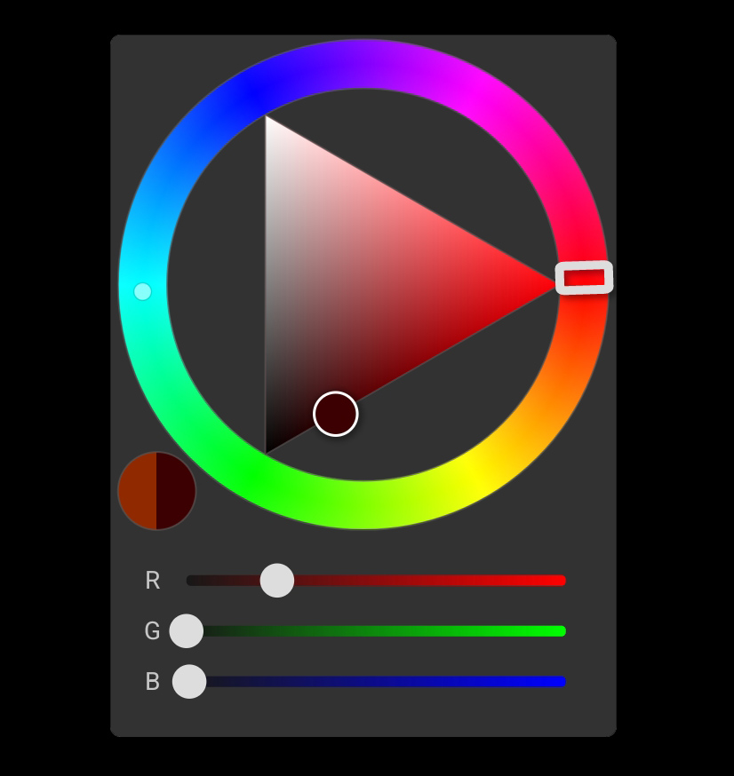

# ColorPickerTriangle
The main class ColorPickerView extends the class android.view.View.

## Usage
Like any View, ColorPickerView can be created either programmatically or using XML.

To retrieve the selected color you can set a listener using setOnColorChange() by passing a lambda function with two arguments: previous color and current color.
You may also set and get color by directly accessing color member of the class.

## Installation
You can install the package through Gradle by adding:
```
implementation 'com.github.BekaErg:ColorPickerTriangle:v1.0.0'
```

## ScreenShot
<a href="ColorPickerExample.jpg"></a>   
